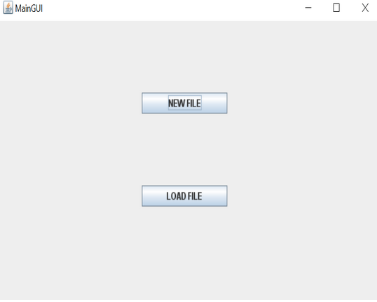
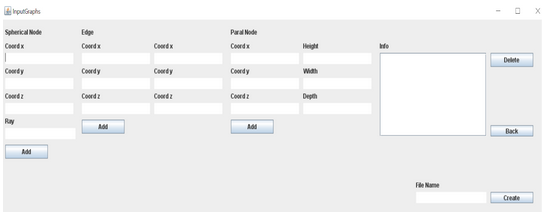
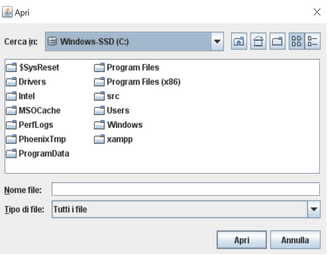

# gltf_builder
Desktop application to generate a 3D model of a graph in .glb or .gltf format file. The model can be generated from an apposite GUI or writing the information about edges and nodes in a text file. 

Took inspiration from [Java glTF MeshBuilder](https://github.com/chadj2/jgltf-mesh).

### 3D Model Generation

The generations of the models is made via a Desktop application, written in the Java language, which, using a GUI, allows to insert
the informations regarding the nodes and the edges of the graphs we want to visualize, or, to obtain such informations from a .txt file.
Specifically the nodes can have two type of shapes:

- Spherical: In this case we need to define the coordinates of the center and of the ray
- Parallelepipedal: In this case we need to indicate the baricenter, the height, width and depth.

Regarding the edges, these are segments, so is sufficient to specify the coordinates of the extremes.
After this, the 3D model are created, using specific Java libraries.
The generated file is of type .glb, the binary representation of a .gltf file (GL Transmission format).
The file is then loaded in the Cloud storage service Google Drive, using the Google APIs.

### Software Architectures

The application is made of a simple GUI, which, initially, allows to choose if we want to create a model, typing the parameters lile
position and dimension of the nodes and of the edges of the graph; or if we want to create the model using a textual file containing
the informations about the graph, using a simple parser.

In the first case, we insert the data using the GUI implemented in the FileMaker class, which communicates the data to the class
ModelBuilder, of the same package.

This, together with the other classes in the package creates the tridimensional model.
This is possible thanks to specific classes, which, after taking the data from the GUI are able to generate tridimensional structures:

- cylindric
- spherical
- parallelpipedal

In the glTF format.

These structures represent the nodes and the archs of the graph we want to visualize.
So the set of classes present in the model_builder package allow the communication between the GUI and the classes needed to
create the .glb file.
In the second case, we upload a .txt file with the data about the graph, separated by the character '#', like position and
dimension of the nodes and edges, using a file chooser.

Then using a simple parser, implemented in the FileLoader class, the data are translated and then they are passed to the classes 
in the model_builder package, in order to obtain the 3D model.

### .glb file creation

The 3D models are obtained building geometries:
- Cylindric
- Spheric
- Parallelpipedal

This is possible thanks to MeshBuilder class.
Each of these geometries represent a *mesh* in the glTF format.
First the input data are passed to a MeshBuilder object via the GUI, which, creates the geometries.
Now the glTF file can be created.
A GltfWriter file is instantiated and is then passed to the build(GltfWriter gltf_writer) method of the MeshBuilder object.
In this way the geometries are added to the 3D model, which is generated by the GltfWriter class, creating the .glb file which represent
the model.
The classes in the model_builder package use the ones described above, to generate the 3D model graphs having the properties defined
by the user, to then save such graphs in a specific directory.

### Loading in Google Drive

Once the nodes and edges have been added by the user, the file creation is started.
Next the process to load the model in the cloud storage service Google Drive is started, thanks to the GoogleDriveService class

To connect the desktop app to such service we needed to download the credentials.json file.
This file allows Google, via the OAuth 2.0 protocol, to identify the applications and the users.
Specifically the user needs to login in his/her Google account, where it wants to load the files.
This process is possible thanks to the Drive API.

